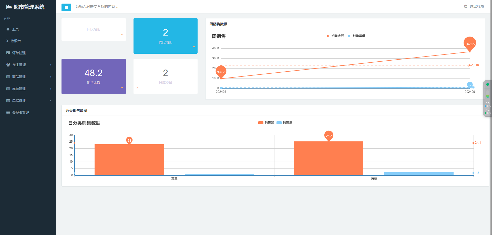
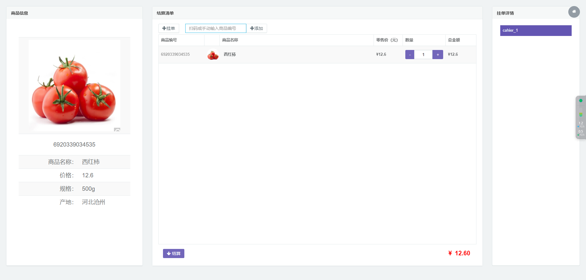
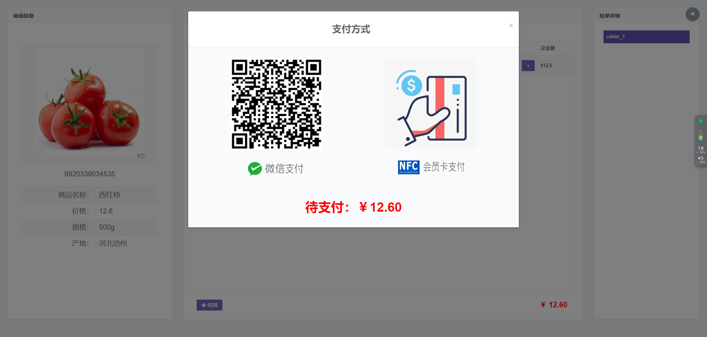
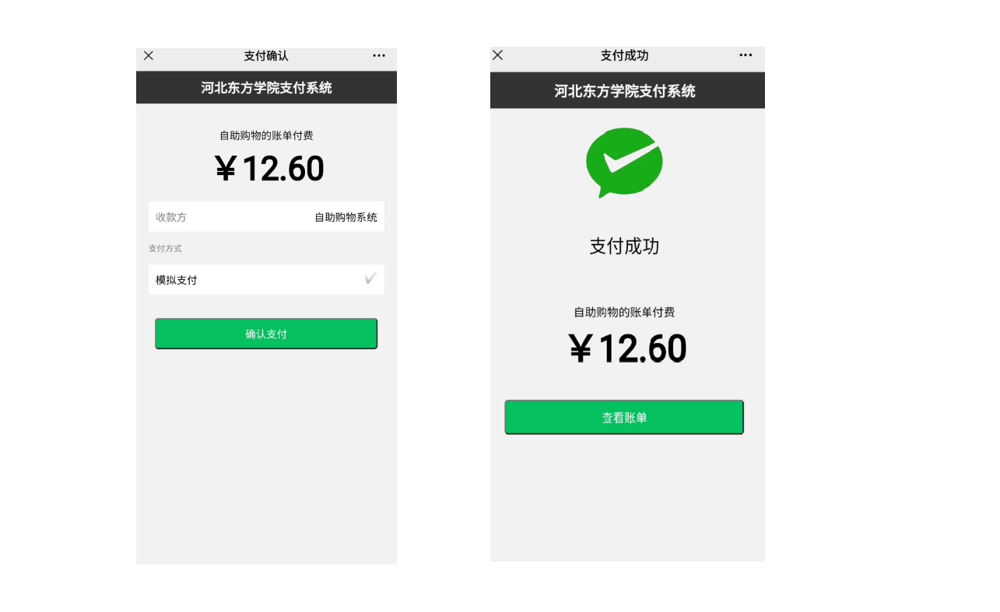
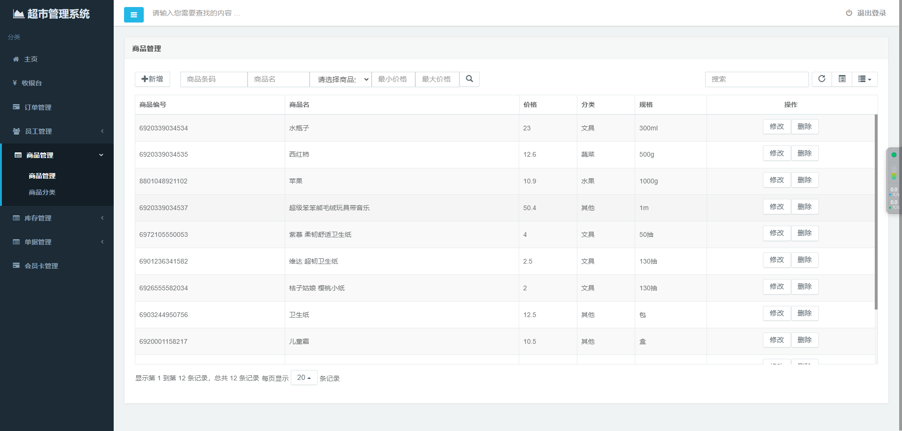
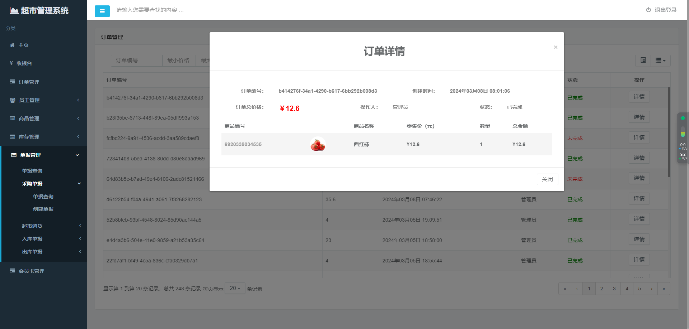

<p><h1 align="center">基于物联网的超市收银管理系统</h1></p>

<p align="center">
	
    
    
    
    
</p>

## 项目开发日志： [Issues进度列表](https://github.com/chuan9964/SupermarketCashierManagementSystem/issues?q=)。

## 环境

- <b>IntelliJ IDEA 2021.1</b>

- <b>Mysql 5.7.34</b>

- <b>Tomcat 8.5.91</b>

- <b>JDK 1.8</b>

#### 项目功能
本系统是基于B/S架构的超市管理系统，为了解决超市对雇员，对商品的管理，提高工作效率而开发。
本系统具有收银记录出纳的功能，记录超市的流水、销售统计功能，可以通过扫码或输入商品编号的方式将商品添加到结算清单，可以使用微信或会员卡刷卡的方式进行支付，可以分类查询某时间段某具体产品的收益，售出情况，对商品进行分类管理，系统可以管理分类，增加分类，修改分类信息，删除分类，可以对商品库存进行管理，实现对商品的模糊查询，分类查询，按生产日期查询，并能对商品进行添加库存，还可以新建商品，修改商品属性，删除商品，此外还有过滤器对访问权限的管理，只有登录系统才可以访问系统页面。

#### 项目用户
超市人员：系统管理员、收银员、仓库管理员

#### 软件架构
BS架构
```
后端 SpringBoot+Maven+Mysql+Shiro+Redis
前端 Bootstrip+Echarts+Thymeleaf+Ajax
```

#### 功能分析

#####  用户管理

##### 权限管理

##### 收银管理

##### 商品管理

##### 库存管理

##### 单据管理

##### 会员卡管理

#### 使用说明

二维码生成
文件位置项目 resources/lib

```
安装
mvn install:install-file -Dfile=e:\QRCode-3.0.jar -DgroupId=QRCode -DartifactId=QRCode -Dversion=3.0 -Dpackaging=jar 
```


## 缩略图









